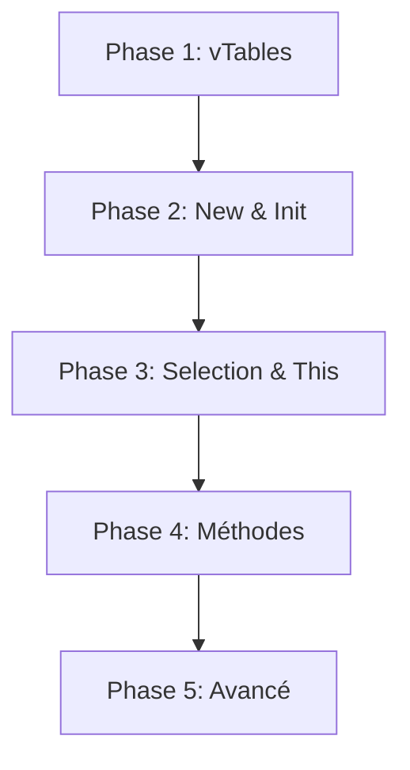

# Plan d'Implémentation - Étape C (Objet)

**Projet** : Compilateur Deca - GL51  
**Objectif** : Implémenter la génération de code pour la programmation orientée objet  
**Architecture** : Pattern Interprète avec allocation de registres naïve (R2-R15)  
**Date** : Janvier 2026

---

## Vue d'Ensemble Technique

### Contraintes Architecturales
- **Registres de calcul** : R2-R15 (doivent être sauvegardés/restaurés dans les méthodes)
- **Registres scratch** : R0-R1 (modifiés par les appels, utilisés pour résultats/temporaires)
- **Gestion mémoire** : Tas dynamique (NEW), pile pour bloc d'activation
- **Liaison dynamique** : Via vTables stockées au début de chaque objet

### Structure d'un Objet en Mémoire
```
Offset 0  : Adresse de la vTable (pointeur)
Offset 1  : Champ hérité (si existe)
Offset 2  : Champ de la classe
...
```

### Structure d'une vTable
```
Offset 0  : Pointeur vers vTable de la super-classe (via LEA)
Offset 1  : Adresse méthode 1 (étiquette code.Classe.methode1)
Offset 2  : Adresse méthode 2
...
```

---

## Phase 1 : Infrastructure & Construction des vTables (Passe 1)

### Objectifs
1. Parcourir toutes les classes pour construire leurs vTables **avant** la génération du code
2. Générer le code assembleur qui empile les vTables au démarrage
3. Mémoriser l'adresse GB de chaque vTable dans `ClassDefinition`

### Fichiers à Modifier

#### 1. [`ListDeclClass.java`](src/main/java/fr/ensimag/deca/tree/ListDeclClass.java)
**Nouvelle méthode** : `codeGenVTables(DecacCompiler compiler)`

```java
public void codeGenVTables(DecacCompiler compiler) {
    LOG.debug("Génération des vTables: start");
    compiler.addComment("===== Construction des tables des méthodes =====");
    
    for (AbstractDeclClass classe : getList()) {
        classe.codeGenVTable(compiler);
    }
    
    LOG.debug("Génération des vTables: end");
}
```

**Justification** : Sépare clairement la passe 1 (vTables) de la passe 2 (code effectif).

#### 2. [`AbstractDeclClass.java`](src/main/java/fr/ensimag/deca/tree/AbstractDeclClass.java) / `DeclClass.java`
**Nouvelle méthode abstraite** : `abstract void codeGenVTable(DecacCompiler compiler)`

**Implémentation dans `DeclClass.java`** :

```java
@Override
protected void codeGenVTable(DecacCompiler compiler) {
    ClassDefinition classDef = getClassSymbol().getClassDefinition();
    String className = getClassName().getName().getName();
    
    compiler.addComment("===== Table des méthodes de " + className + " =====");
    
    // 1. Mémoriser l'adresse GB où commence la vTable
    int addrVTable = compiler.getRegisterManager().getNbGlobales() + 1;
    classDef.setVTableAddr(addrVTable); // NOUVEAU champ dans ClassDefinition
    compiler.getRegisterManager().incrNbGlobales(); // Réserver 1 emplacement par méthode + 1 pour super
    
    // 2. Générer le pointeur vers la vTable de la super-classe
    ClassDefinition superClassDef = classDef.getSuperClass();
    if (superClassDef.getType().isObject()) {
        // Classe Object : pas de super-classe
        compiler.addInstruction(new LOAD(new NullOperand(), Register.R0));
    } else {
        // LEA addrSuperVTable(GB), R0
        compiler.addInstruction(new LEA(
            new RegisterOffset(superClassDef.getVTableAddr(), Register.GB), 
            Register.R0
        ));
    }
    compiler.addInstruction(new STORE(Register.R0, new RegisterOffset(addrVTable, Register.GB)));
    
    // 3. Parcourir les méthodes dans l'ordre de leurs index
    int nbMethods = classDef.getNumberOfMethods();
    for (int i = 0; i < nbMethods; i++) {
        MethodDefinition methodDef = classDef.getMethodByIndex(i); // NOUVELLE méthode utilitaire
        String methodLabel = "code." + className + "." + methodDef.getLabel().getName();
        
        compiler.getRegisterManager().incrNbGlobales();
        int offset = addrVTable + 1 + i;
        
        compiler.addInstruction(new LOAD(new LabelOperand(new Label(methodLabel)), Register.R0));
        compiler.addInstruction(new STORE(Register.R0, new RegisterOffset(offset, Register.GB)));
    }
}
```

**Modifications nécessaires dans [`ClassDefinition.java`](src/main/java/fr/ensimag/deca/context/ClassDefinition.java)** :
```java
private int vTableAddr; // Adresse dans GB où commence la vTable

public int getVTableAddr() { return vTableAddr; }
public void setVTableAddr(int addr) { this.vTableAddr = addr; }

// Nouvelle méthode utilitaire
public MethodDefinition getMethodByIndex(int index) {
    // Parcourir getMembers() pour trouver la méthode à cet index
    for (Definition def : getMembers().values()) {
        if (def.isMethod() && ((MethodDefinition)def).getIndex() == index) {
            return (MethodDefinition)def;
        }
    }
    return null;
}
```

#### 3. [`Program.java`](src/main/java/fr/ensimag/deca/tree/Program.java)
**Modifier `codeGenProgram()`** pour appeler la passe 1 **avant** le main :

```java
@Override
public void codeGenProgram(DecacCompiler compiler) {
    // ===== PASSE 1 : Construction des vTables =====
    classes.codeGenVTables(compiler);
    
    // ===== PASSE 2 : Programme Principal =====
    compiler.addComment("===== Main program =====");
    main.codeGenMain(compiler);
    compiler.addInstruction(new HALT());
    
    // Gestion des erreurs...
    compiler.addLabel(new Label("tas_plein"));
    compiler.addInstruction(new WSTR("Error: Heap Overflow"));
    compiler.addInstruction(new WNL());
    compiler.addInstruction(new ERROR());
    
    compiler.addLabel(new Label("dereferencement_null"));
    compiler.addInstruction(new WSTR("Error: Null Dereference"));
    compiler.addInstruction(new WNL());
    compiler.addInstruction(new ERROR());
    
    // ... (autres labels d'erreur)
}
```

### Test de Validation : `test_vtable.deca`

```java
// Test basique de construction de vTable
class A {
    void methodA() { println("A"); }
}

class B extends A {
    void methodA() { println("B"); } // Redéfinition
    void methodB() { println("B2"); }
}

{
    // Pas d'instanciation encore, juste vérifier que le code compile
    // et que les vTables sont générées sans erreur
}
```

**Commande** : `./src/main/bin/decac test_vtable.deca && cat test_vtable.ass | grep "Table des méthodes"`

**Résultat attendu** : Le fichier `.ass` doit contenir :
```assembly
; ===== Table des méthodes de A =====
LOAD null, R0
STORE R0, 1(GB)
LOAD #code.A.methodA, R0
STORE R0, 2(GB)

; ===== Table des méthodes de B =====
LEA 1(GB), R0    ; Pointeur vers vTable de A
STORE R0, 3(GB)
LOAD #code.B.methodA, R0
STORE R0, 4(GB)
LOAD #code.B.methodB, R0
STORE R0, 5(GB)
```

---

## Phase 2 : Allocation (New) & Initialisation (init.X)

### Objectifs
1. Implémenter l'instruction `NEW` avec vérification `BOV tas_plein`
2. Générer les sous-programmes `init.Classe` pour initialiser les champs
3. Chaîner l'appel `init.SuperClasse` → `init.Classe`

### Fichiers à Modifier

#### 1. [`New.java`](src/main/java/fr/ensimag/deca/tree/New.java)
**Méthode** : `codeGenExpr(DecacCompiler compiler, GPRegister register)`

```java
@Override
protected void codeGenExpr(DecacCompiler compiler, GPRegister register) {
    ClassDefinition classDef = getType().asClassType("Not a class", getLocation()).getDefinition();
    int nbFields = classDef.getNumberOfFields();
    int objectSize = 1 + nbFields; // 1 pour vTable + champs
    
    // NEW #objectSize, register
    compiler.addInstruction(new NEW(new ImmediateInteger(objectSize), register));
    
    // Vérification débordement tas
    if (!compiler.getCompilerOptions().getNoCheck()) {
        compiler.addInstruction(new BOV(new Label("tas_plein")));
    }
    
    // Stocker l'adresse de la vTable à l'offset 0 de l'objet
    int vTableAddr = classDef.getVTableAddr();
    compiler.addInstruction(new LEA(new RegisterOffset(vTableAddr, Register.GB), Register.R0));
    compiler.addInstruction(new STORE(Register.R0, new RegisterOffset(0, register)));
    
    // Appeler init.Classe(this)
    // PUSH this (dans register)
    compiler.addInstruction(new PUSH(register));
    compiler.getRegisterManager().empiler();
    
    // BSR init.Classe
    String className = classDef.getType().getName().getName();
    compiler.addInstruction(new BSR(new Label("init." + className)));
    
    // POP (nettoyer la pile, mais résultat déjà dans register)
    compiler.addInstruction(new SUBSP(new ImmediateInteger(1))); // Enlever le paramètre this
    compiler.getRegisterManager().depiler();
}
```

**Vérification contextuelle** : Déjà implémentée dans l'étape B (`verifyExpr` retourne `ClassType`).

#### 2. [`DeclClass.java`](src/main/java/fr/ensimag/deca/tree/DeclClass.java)
**Nouvelle méthode** : `codeGenInit(DecacCompiler compiler)`

```java
protected void codeGenInit(DecacCompiler compiler) {
    ClassDefinition classDef = getClassSymbol().getClassDefinition();
    String className = getClassName().getName().getName();
    
    compiler.addLabel(new Label("init." + className));
    compiler.addComment("===== Initialisation de " + className + " =====");
    
    // 1. Sauvegarder les registres utilisés (R2-R15)
    // NOTE: Pour l'initialisation, on utilise peu de registres, mais par sécurité
    compiler.addInstruction(new PUSH(Register.R2));
    
    // 2. Mettre les NOUVEAUX champs à zéro
    // (this est à -2(LB) après le BSR)
    compiler.addInstruction(new LOAD(new RegisterOffset(-2, Register.LB), Register.R2)); // this dans R2
    
    int firstNewFieldOffset = classDef.getSuperClass().getNumberOfFields() + 1;
    int nbNewFields = classDef.getNumberOfFields() - classDef.getSuperClass().getNumberOfFields();
    
    for (int i = 0; i < nbNewFields; i++) {
        compiler.addInstruction(new LOAD(new ImmediateInteger(0), Register.R0));
        compiler.addInstruction(new STORE(Register.R0, new RegisterOffset(firstNewFieldOffset + i, Register.R2)));
    }
    
    // 3. Appeler init.SuperClasse si pas Object
    if (!classDef.getSuperClass().getType().isObject()) {
        compiler.addInstruction(new PUSH(Register.R2)); // Empiler this
        String superClassName = classDef.getSuperClass().getType().getName().getName();
        compiler.addInstruction(new BSR(new Label("init." + superClassName)));
        compiler.addInstruction(new SUBSP(new ImmediateInteger(1)));
    }
    
    // 4. Générer le code des initialisations explicites
    getFields().codeGenListDeclField(compiler); // Nouveau dans ListDeclField
    
    // 5. Restaurer registres et retourner
    compiler.addInstruction(new POP(Register.R2));
    compiler.addInstruction(new RTS());
}
```

#### 3. [`ListDeclField.java`](src/main/java/fr/ensimag/deca/tree/ListDeclField.java)
**Nouvelle méthode** : `codeGenListDeclField(DecacCompiler compiler)`

```java
public void codeGenListDeclField(DecacCompiler compiler) {
    for (AbstractDeclField field : getList()) {
        field.codeGenInitField(compiler);
    }
}
```

#### 4. [`DeclField.java`](src/main/java/fr/ensimag/deca/tree/DeclField.java)
**Nouvelle méthode** : `codeGenInitField(DecacCompiler compiler)`

```java
protected void codeGenInitField(DecacCompiler compiler) {
    // Si pas d'initialisation explicite, déjà à 0
    if (getInitialization().getExpression() == null) return;
    
    // Calculer la valeur d'initialisation dans R0
    GPRegister reg = compiler.getRegisterManager().prendreRegistre();
    getInitialization().getExpression().codeGenExpr(compiler, reg);
    
    // Stocker dans this.champ
    compiler.addInstruction(new LOAD(new RegisterOffset(-2, Register.LB), Register.R1)); // this
    int fieldOffset = getFieldName().getFieldDefinition().getIndex();
    compiler.addInstruction(new STORE(reg, new RegisterOffset(fieldOffset, Register.R1)));
    
    compiler.getRegisterManager().libererRegistre();
}
```

#### 5. [`Program.java`](src/main/java/fr/ensimag/deca/tree/Program.java)
**Modifier `codeGenProgram()`** pour générer les `init` **après** les vTables mais **avant** le main :

```java
@Override
public void codeGenProgram(DecacCompiler compiler) {
    // PASSE 1 : vTables
    classes.codeGenVTables(compiler);
    
    // PASSE 2A : Sous-programmes init
    compiler.addComment("===== Sous-programmes d'initialisation =====");
    classes.codeGenListInit(compiler); // NOUVELLE méthode
    
    // PASSE 2B : Programme Principal
    compiler.addComment("===== Main program =====");
    main.codeGenMain(compiler);
    compiler.addInstruction(new HALT());
    
    // ... (gestion erreurs)
}
```

#### 6. [`ListDeclClass.java`](src/main/java/fr/ensimag/deca/tree/ListDeclClass.java)
**Nouvelle méthode** : `codeGenListInit(DecacCompiler compiler)`

```java
public void codeGenListInit(DecacCompiler compiler) {
    for (AbstractDeclClass classe : getList()) {
        classe.codeGenInit(compiler);
    }
}
```

### Test de Validation : `test_new.deca`

```java
class Point {
    int x = 5;
    int y;
}

{
    Point p;
    p = new Point();
    // Vérifier que p n'est pas null et que x = 5, y = 0
}
```

**Commande** : `./src/main/bin/decac test_new.deca && ima test_new.ass`

**Résultat attendu** : Pas d'erreur d'exécution. Le fichier `.ass` contient :
```assembly
init.Point:
    PUSH R2
    LOAD -2(LB), R2   ; this
    LOAD #0, R0
    STORE R0, 2(R2)   ; y = 0
    LOAD #5, R0
    STORE R0, 1(R2)   ; x = 5
    POP R2
    RTS
```

---

## Phase 3 : Accès Champs (Selection & This)

### Objectifs
1. Implémenter `This` : retourner l'adresse `-2(LB)`
2. Implémenter `Selection` : vérifier null puis accéder à l'offset du champ
3. Gérer l'affectation de champs (`objet.champ = expr`)

### Fichiers à Modifier

#### 1. [`This.java`](src/main/java/fr/ensimag/deca/tree/This.java)
**Méthode** : `codeGenExpr(DecacCompiler compiler, GPRegister register)`

```java
@Override
protected void codeGenExpr(DecacCompiler compiler, GPRegister register) {
    // this est toujours à -2(LB) dans les méthodes
    compiler.addInstruction(new LOAD(new RegisterOffset(-2, Register.LB), register));
}
```

**Vérification contextuelle** : Déjà implémentée (vérifie qu'on est dans une méthode).

#### 2. [`Selection.java`](src/main/java/fr/ensimag/deca/tree/Selection.java)
**Méthodes** : `codeGenExpr`, `codeGenLValue`

```java
@Override
protected void codeGenExpr(DecacCompiler compiler, GPRegister register) {
    // 1. Évaluer l'objet (partie gauche)
    getObject().codeGenExpr(compiler, register);
    
    // 2. Vérifier null
    if (!compiler.getCompilerOptions().getNoCheck()) {
        compiler.addInstruction(new CMP(new NullOperand(), register));
        compiler.addInstruction(new BEQ(new Label("dereferencement_null")));
    }
    
    // 3. Accéder au champ
    int fieldOffset = getFieldName().getFieldDefinition().getIndex();
    compiler.addInstruction(new LOAD(new RegisterOffset(fieldOffset, register), register));
}

// Pour les affectations (objet.champ = expr)
protected DAddr codeGenLValue(DecacCompiler compiler) {
    GPRegister regObject = compiler.getRegisterManager().prendreRegistre();
    getObject().codeGenExpr(compiler, regObject);
    
    // Vérifier null
    if (!compiler.getCompilerOptions().getNoCheck()) {
        compiler.addInstruction(new CMP(new NullOperand(), regObject));
        compiler.addInstruction(new BEQ(new Label("dereferencement_null")));
    }
    
    int fieldOffset = getFieldName().getFieldDefinition().getIndex();
    return new RegisterOffset(fieldOffset, regObject);
}
```

#### 3. [`Assign.java`](src/main/java/fr/ensimag/deca/tree/Assign.java)
**Modifier `codeGenExpr`** pour gérer les `Selection` :

```java
@Override
protected void codeGenExpr(DecacCompiler compiler, GPRegister register) {
    AbstractLValue lValue = getLeftOperand();
    
    if (lValue instanceof Selection) {
        // Cas objet.champ = expr
        DAddr addr = ((Selection)lValue).codeGenLValue(compiler);
        getRightOperand().codeGenExpr(compiler, register);
        compiler.addInstruction(new STORE(register, addr));
        // Libérer le registre de l'objet si alloué
    } else if (lValue instanceof Identifier) {
        // Cas variable = expr (déjà implémenté)
        getRightOperand().codeGenExpr(compiler, register);
        compiler.addInstruction(new STORE(register, ((Identifier)lValue).getExpDefinition().getOperand()));
    }
}
```

### Test de Validation : `test_champs.deca`

```java
class Point {
    int x = 10;
    int y = 20;
}

{
    Point p = new Point();
    println(p.x);  // Doit afficher 10
    p.y = 99;
    println(p.y);  // Doit afficher 99
}
```

**Commande** : `./src/main/bin/decac test_champs.deca && ima test_champs.ass`

**Résultat attendu** :
```
10
99
```

---

## Phase 4 : Appels de Méthodes & Return

### Objectifs
1. Générer le code des méthodes avec gestion complète des registres (PUSH/POP R2-R15)
2. Calculer `TSTO` dynamique pour chaque méthode
3. Implémenter l'appel de méthode avec liaison dynamique
4. Gérer `return expr` (placement dans R0)

### Fichiers à Modifier

#### 1. [`DeclMethod.java`](src/main/java/fr/ensimag/deca/tree/DeclMethod.java)
**Nouvelle méthode** : `codeGenMethod(DecacCompiler compiler)`

```java
protected void codeGenMethod(DecacCompiler compiler) {
    String className = getCurrentClass().getName().getName();
    String methodName = getMethodName().getName().getName();
    
    compiler.addLabel(new Label("code." + className + "." + methodName));
    compiler.addComment("===== Méthode " + className + "." + methodName + " =====");
    
    // 1. Réinitialiser le RegisterManager pour ce nouveau bloc
    compiler.getRegisterManager().resetForNewBlock();
    
    // 2. Générer le corps (pour calculer TSTO)
    // On génère d'abord dans un buffer temporaire
    IMAProgram tempProgram = compiler.swapProgram(new IMAProgram()); // NOUVELLE méthode utilitaire
    
    // Sauvegarder R2-R15 (on va calculer lesquels sont utilisés)
    List<GPRegister> usedRegisters = new ArrayList<>();
    for (int i = 2; i <= compiler.getRegisterManager().getRegistreMax(); i++) {
        usedRegisters.add(Register.getR(i));
    }
    
    for (GPRegister reg : usedRegisters) {
        compiler.addInstruction(new PUSH(reg));
        compiler.getRegisterManager().empiler();
    }
    
    // Générer le code du corps
    getMethodBody().codeGenInst(compiler);
    
    // Label de fin (pour les return)
    compiler.addLabel(new Label("end." + className + "." + methodName));
    
    // Restaurer R2-R15
    for (int i = usedRegisters.size() - 1; i >= 0; i--) {
        compiler.addInstruction(new POP(usedRegisters.get(i)));
        compiler.getRegisterManager().depiler();
    }
    
    compiler.addInstruction(new RTS());
    
    // 3. Récupérer le TSTO calculé
    int tstoValue = compiler.getRegisterManager().getTSTOValue();
    IMAProgram bodyProgram = compiler.swapProgram(tempProgram);
    
    // 4. Insérer TSTO en tête
    compiler.addInstruction(new TSTO(new ImmediateInteger(tstoValue)));
    if (!compiler.getCompilerOptions().getNoCheck()) {
        compiler.addInstruction(new BOV(new Label("erreur_pile_OV")));
    }
    
    // 5. ADDSP pour les variables locales
    int nbLocals = getMethodBody().countLocalVariables(); // NOUVELLE méthode
    if (nbLocals > 0) {
        compiler.addInstruction(new ADDSP(new ImmediateInteger(nbLocals)));
    }
    
    // 6. Réinsérer le code du corps
    compiler.appendProgram(bodyProgram); // NOUVELLE méthode
}
```

**Modifications nécessaires dans [`DecacCompiler.java`](src/main/java/fr/ensimag/deca/DecacCompiler.java)** :
```java
// Utilitaire pour générer temporairement dans un autre IMAProgram
public IMAProgram swapProgram(IMAProgram newProg) {
    IMAProgram old = this.program;
    this.program = newProg;
    return old;
}

public void appendProgram(IMAProgram prog) {
    for (AbstractLine line : prog.getLines()) {
        this.program.add(line);
    }
}
```

**Modifications dans [`RegisterManager.java`](src/main/java/fr/ensimag/deca/codegen/RegisterManager.java)** :
```java
public void resetForNewBlock() {
    taillePileCourante = 0;
    taillePileMax = 0;
    // Ne PAS réinitialiser registreCourant (contexte local)
}

public int getTSTOValue() {
    return taillePileMax + nbGlobales; // TSTO = max(spills) + locales
}
```

#### 2. [`Return.java`](src/main/java/fr/ensimag/deca/tree/Return.java)
**Méthode** : `codeGenInst(DecacCompiler compiler)`

```java
@Override
protected void codeGenInst(DecacCompiler compiler) {
    // 1. Évaluer l'expression de retour dans R0
    getReturnExpr().codeGenExpr(compiler, Register.R0);
    
    // 2. Sauter vers le label de fin de la méthode
    String className = getCurrentClass().getName().getName();
    String methodName = getCurrentMethod().getName().getName();
    compiler.addInstruction(new BRA(new Label("end." + className + "." + methodName)));
}
```

**Vérification contextuelle** : Déjà implémentée (vérifie que le type de retour correspond).

#### 3. [`MethodCall.java`](src/main/java/fr/ensimag/deca/tree/MethodCall.java)
**Méthode** : `codeGenExpr(DecacCompiler compiler, GPRegister register)`

```java
@Override
protected void codeGenExpr(DecacCompiler compiler, GPRegister register) {
    ClassType classType = getObject().getType().asClassType("Not a class", getLocation());
    ClassDefinition classDef = classType.getDefinition();
    MethodDefinition methodDef = getMethodName().getMethodDefinition();
    
    // 1. Empiler les paramètres en ordre inverse
    ListExpr params = getArguments();
    for (int i = params.size() - 1; i >= 0; i--) {
        GPRegister paramReg = compiler.getRegisterManager().prendreRegistre();
        params.getList().get(i).codeGenExpr(compiler, paramReg);
        compiler.addInstruction(new PUSH(paramReg));
        compiler.getRegisterManager().empiler();
        compiler.getRegisterManager().libererRegistre();
    }
    
    // 2. Empiler this (l'objet)
    getObject().codeGenExpr(compiler, register);
    
    // Vérifier null
    if (!compiler.getCompilerOptions().getNoCheck()) {
        compiler.addInstruction(new CMP(new NullOperand(), register));
        compiler.addInstruction(new BEQ(new Label("dereferencement_null")));
    }
    
    compiler.addInstruction(new PUSH(register));
    compiler.getRegisterManager().empiler();
    
    // 3. Liaison dynamique : récupérer l'adresse de la méthode depuis la vTable
    // vTable = [objet + 0]
    compiler.addInstruction(new LOAD(new RegisterOffset(0, register), register)); // Adresse vTable
    
    // Adresse méthode = vTable[index+1] (offset +1 car vTable[0] = super)
    int methodIndex = methodDef.getIndex();
    compiler.addInstruction(new LOAD(new RegisterOffset(methodIndex + 1, register), register));
    
    // 4. Appel indirect
    compiler.addInstruction(new BSR(register)); // BSR Rm (IMA 2.9)
    
    // 5. Nettoyer la pile (this + params)
    int nbParams = params.size();
    compiler.addInstruction(new SUBSP(new ImmediateInteger(nbParams + 1)));
    for (int i = 0; i < nbParams + 1; i++) {
        compiler.getRegisterManager().depiler();
    }
    
    // 6. Résultat dans R0, le copier dans register
    if (!register.equals(Register.R0)) {
        compiler.addInstruction(new LOAD(Register.R0, register));
    }
}
```

#### 4. [`ListDeclClass.java`](src/main/java/fr/ensimag/deca/tree/ListDeclClass.java)
**Nouvelle méthode** : `codeGenListMethods(DecacCompiler compiler)`

```java
public void codeGenListMethods(DecacCompiler compiler) {
    compiler.addComment("===== Code des méthodes =====");
    for (AbstractDeclClass classe : getList()) {
        classe.codeGenMethods(compiler);
    }
}
```

#### 5. [`DeclClass.java`](src/main/java/fr/ensimag/deca/tree/DeclClass.java)
**Nouvelle méthode** : `codeGenMethods(DecacCompiler compiler)`

```java
protected void codeGenMethods(DecacCompiler compiler) {
    compiler.addComment("===== Méthodes de " + getClassName().getName().getName() + " =====");
    getClassBody().codeGenListDeclMethod(compiler); // NOUVELLE méthode dans ListDeclMethod
}
```

#### 6. [`Program.java`](src/main/java/fr/ensimag/deca/tree/Program.java)
**Modifier `codeGenProgram()`** pour générer les méthodes **après** init mais **avant** main :

```java
@Override
public void codeGenProgram(DecacCompiler compiler) {
    // PASSE 1 : vTables
    classes.codeGenVTables(compiler);
    
    // PASSE 2A : Init
    classes.codeGenListInit(compiler);
    
    // PASSE 2B : Méthodes
    classes.codeGenListMethods(compiler);
    
    // PASSE 2C : Main
    compiler.addComment("===== Main program =====");
    main.codeGenMain(compiler);
    compiler.addInstruction(new HALT());
    
    // ... (gestion erreurs)
}
```

### Test de Validation : `test_methode.deca`

```java
class Point {
    int x = 5;
    int y = 10;
    
    int getX() {
        return x;
    }
    
    void setX(int newX) {
        x = newX;
    }
}

{
    Point p = new Point();
    println(p.getX());    // Doit afficher 5
    p.setX(42);
    println(p.getX());    // Doit afficher 42
}
```

**Commande** : `./src/main/bin/decac test_methode.deca && ima test_methode.ass`

**Résultat attendu** :
```
5
42
```

---

## Phase 5 : Paramètres, Instanceof, Cast & Gestion Complète des Erreurs

### Objectifs
1. Gérer correctement l'accès aux paramètres dans les méthodes (offset `-3(LB)`, `-4(LB)`, etc.)
2. Implémenter `instanceof` (remontée de chaîne de vTables)
3. Implémenter `cast` avec vérification runtime
4. Compléter tous les labels d'erreur

### Fichiers à Modifier

#### 1. [`DeclParam.java`](src/main/java/fr/ensimag/deca/tree/DeclParam.java)
**Nouvelle méthode** : `codeGenParam(DecacCompiler compiler, int paramIndex)`

```java
protected void codeGenParam(DecacCompiler compiler, int paramIndex) {
    // Les paramètres sont stockés dans la pile à -3(LB), -4(LB), ...
    // paramIndex = 0 pour le premier paramètre
    int offset = -3 - paramIndex;
    
    ParamDefinition paramDef = getParamName().getParamDefinition();
    paramDef.setOperand(new RegisterOffset(offset, Register.LB));
}
```

**Appel depuis `DeclMethod.codeGenMethod()`** :
```java
// Avant de générer le corps, définir les opérandes des paramètres
ListDeclParam params = getParams();
for (int i = 0; i < params.size(); i++) {
    params.getList().get(i).codeGenParam(compiler, i);
}
```

#### 2. [`Identifier.java`](src/main/java/fr/ensimag/deca/tree/Identifier.java)
**Modifier `codeGenExpr`** pour gérer les paramètres :

```java
@Override
protected void codeGenExpr(DecacCompiler compiler, GPRegister register) {
    Definition def = getDefinition();
    
    if (def.isParam()) {
        // Paramètre de méthode
        compiler.addInstruction(new LOAD(def.getOperand(), register));
    } else if (!def.isField()) {
        // Variable locale/globale (déjà implémenté)
        compiler.addInstruction(new LOAD(getExpDefinition().getOperand(), register));
    } else {
        // Champ (accès implicite via this)
        compiler.addInstruction(new LOAD(new RegisterOffset(-2, Register.LB), register)); // this
        int fieldOffset = getFieldDefinition().getIndex();
        compiler.addInstruction(new LOAD(new RegisterOffset(fieldOffset, register), register));
    }
}
```

#### 3. [`InstanceOf.java`](src/main/java/fr/ensimag/deca/tree/InstanceOf.java)
**Méthode** : `codeGenExpr(DecacCompiler compiler, GPRegister register)`

```java
@Override
protected void codeGenExpr(DecacCompiler compiler, GPRegister register) {
    ClassType targetType = getTargetType().getType().asClassType("Not a class", getLocation());
    ClassDefinition targetClassDef = targetType.getDefinition();
    
    // 1. Évaluer l'objet
    getObject().codeGenExpr(compiler, register);
    
    // 2. Si null, retourner false
    compiler.addInstruction(new CMP(new NullOperand(), register));
    Label notNull = new Label("instanceof_not_null_" + getInstanceOfCounter()); // Compteur statique
    compiler.addInstruction(new BNE(notNull));
    compiler.addInstruction(new LOAD(new ImmediateInteger(0), register)); // false
    Label end = new Label("instanceof_end_" + getInstanceOfCounter());
    compiler.addInstruction(new BRA(end));
    
    // 3. Remonter la chaîne des vTables
    compiler.addLabel(notNull);
    compiler.addInstruction(new LOAD(new RegisterOffset(0, register), register)); // vTable actuelle
    
    int targetVTableAddr = targetClassDef.getVTableAddr();
    Label loop = new Label("instanceof_loop_" + getInstanceOfCounter());
    Label found = new Label("instanceof_found_" + getInstanceOfCounter());
    
    compiler.addLabel(loop);
    // Comparer vTable actuelle avec vTable cible
    compiler.addInstruction(new LOAD(new RegisterOffset(targetVTableAddr, Register.GB), Register.R0));
    compiler.addInstruction(new CMP(Register.R0, register));
    compiler.addInstruction(new BEQ(found));
    
    // Remonter à la super-classe
    compiler.addInstruction(new LOAD(new RegisterOffset(0, register), register)); // vTable[0] = super
    compiler.addInstruction(new CMP(new NullOperand(), register));
    compiler.addInstruction(new BNE(loop)); // Si pas null, continuer
    
    // Pas trouvé : retourner false
    compiler.addInstruction(new LOAD(new ImmediateInteger(0), register));
    compiler.addInstruction(new BRA(end));
    
    // Trouvé : retourner true
    compiler.addLabel(found);
    compiler.addInstruction(new LOAD(new ImmediateInteger(1), register));
    
    compiler.addLabel(end);
}

// Compteur statique pour labels uniques
private static int instanceOfCounter = 0;
private static int getInstanceOfCounter() { return instanceOfCounter++; }
```

#### 4. [`Cast.java`](src/main/java/fr/ensimag/deca/tree/Cast.java)
**Méthode** : `codeGenExpr(DecacCompiler compiler, GPRegister register)`

```java
@Override
protected void codeGenExpr(DecacCompiler compiler, GPRegister register) {
    ClassType targetType = getCastType().getType().asClassType("Not a class", getLocation());
    
    // 1. Évaluer l'objet
    getObject().codeGenExpr(compiler, register);
    
    // 2. Si null, cast OK (null peut être casté en n'importe quoi)
    compiler.addInstruction(new CMP(new NullOperand(), register));
    Label end = new Label("cast_end_" + getCastCounter());
    compiler.addInstruction(new BEQ(end));
    
    // 3. Vérifier instanceof (réutiliser la logique ci-dessus)
    // Si instanceof échoue, sauter vers cast_error
    // (Pour simplifier, on peut copier la logique instanceof ici)
    
    // Version simplifiée : dupliquer le code instanceof
    ClassDefinition targetClassDef = targetType.getDefinition();
    GPRegister tempReg = Register.R0;
    compiler.addInstruction(new LOAD(new RegisterOffset(0, register), tempReg)); // vTable
    
    int targetVTableAddr = targetClassDef.getVTableAddr();
    Label loop = new Label("cast_loop_" + getCastCounter());
    Label success = new Label("cast_success_" + getCastCounter());
    
    compiler.addLabel(loop);
    compiler.addInstruction(new LOAD(new RegisterOffset(targetVTableAddr, Register.GB), Register.R1));
    compiler.addInstruction(new CMP(Register.R1, tempReg));
    compiler.addInstruction(new BEQ(success));
    
    compiler.addInstruction(new LOAD(new RegisterOffset(0, tempReg), tempReg)); // super
    compiler.addInstruction(new CMP(new NullOperand(), tempReg));
    compiler.addInstruction(new BNE(loop));
    
    // Échec du cast
    compiler.addInstruction(new BRA(new Label("cast_error")));
    
    compiler.addLabel(success);
    compiler.addLabel(end);
}

private static int castCounter = 0;
private static int getCastCounter() { return castCounter++; }
```

#### 5. [`Program.java`](src/main/java/fr/ensimag/deca/tree/Program.java)
**Compléter `codeGenProgram()`** avec tous les labels d'erreur :

```java
@Override
public void codeGenProgram(DecacCompiler compiler) {
    // ... (passe 1, 2A, 2B, 2C, main, HALT)
    
    // ===== GESTION DES ERREURS =====
    compiler.addComment("===== Gestion des erreurs runtime =====");
    
    // Erreur de pile (Stack Overflow)
    compiler.addLabel(new Label("erreur_pile_OV"));
    compiler.addInstruction(new WSTR("Error: Stack Overflow"));
    compiler.addInstruction(new WNL());
    compiler.addInstruction(new ERROR());
    
    // Erreur de tas (Heap Overflow)
    compiler.addLabel(new Label("tas_plein"));
    compiler.addInstruction(new WSTR("Error: Heap Overflow"));
    compiler.addInstruction(new WNL());
    compiler.addInstruction(new ERROR());
    
    // Déréférencement de null
    compiler.addLabel(new Label("dereferencement_null"));
    compiler.addInstruction(new WSTR("Error: Null Dereference"));
    compiler.addInstruction(new WNL());
    compiler.addInstruction(new ERROR());
    
    // Erreur de cast
    compiler.addLabel(new Label("cast_error"));
    compiler.addInstruction(new WSTR("Error: Invalid Cast"));
    compiler.addInstruction(new WNL());
    compiler.addInstruction(new ERROR());
    
    // Erreur d'I/O (déjà présente)
    compiler.addLabel(new Label("erreur_io"));
    compiler.addInstruction(new WSTR("Error: I/O Error"));
    compiler.addInstruction(new WNL());
    compiler.addInstruction(new ERROR());
    
    // Division par zéro (si pas déjà présent)
    compiler.addLabel(new Label("division_par_0"));
    compiler.addInstruction(new WSTR("Error: Division by Zero"));
    compiler.addInstruction(new WNL());
    compiler.addInstruction(new ERROR());
}
```

### Test de Validation : `test_complet.deca`

```java
class Animal {
    void crier() {
        println("Son animal");
    }
}

class Chien extends Animal {
    void crier() {
        println("Woof!");
    }
    
    void courirVite(int vitesse) {
        println(vitesse);
    }
}

{
    Animal a = new Chien();
    a.crier();  // Doit afficher "Woof!" (liaison dynamique)
    
    if (a instanceof Chien) {
        println("a est un Chien");
        Chien c = (Chien)(a);
        c.courirVite(50);
    }
    
    // Test cast invalide (doit générer erreur si décommenté)
    // Animal a2 = new Animal();
    // Chien c2 = (Chien)(a2); // Erreur runtime
}
```

**Commande** : `./src/main/bin/decac test_complet.deca && ima test_complet.ass`

**Résultat attendu** :
```
Woof!
a est un Chien
50
```

---

## Checklist de Validation Complète

### Phase 1 : vTables ✅
- [ ] Les vTables sont générées avant le main
- [ ] Chaque vTable contient un pointeur vers la super-classe
- [ ] Les adresses des méthodes sont correctes
- [ ] `ClassDefinition.vTableAddr` est correctement mémorisé

### Phase 2 : New & Init ✅
- [ ] `NEW` alloue la bonne taille (1 + nbFields)
- [ ] `BOV tas_plein` fonctionne
- [ ] L'adresse de la vTable est stockée à l'offset 0
- [ ] Les champs sont initialisés à 0
- [ ] `init.SuperClasse` est appelé avant les inits explicites
- [ ] Les initialisations explicites fonctionnent

### Phase 3 : Selection & This ✅
- [ ] `this` retourne bien `-2(LB)`
- [ ] `objet.champ` vérifie null avant accès
- [ ] L'offset du champ est correct
- [ ] `objet.champ = expr` fonctionne

### Phase 4 : Méthodes & Return ✅
- [ ] Les méthodes sauvegardent/restaurent R2-R15
- [ ] `TSTO` est calculé dynamiquement
- [ ] Les paramètres sont accessibles à `-3(LB)`, `-4(LB)`, etc.
- [ ] `return expr` place la valeur dans R0 et saute à `end.Classe.methode`
- [ ] L'appel de méthode empile les paramètres puis `this`
- [ ] La liaison dynamique via vTable fonctionne
- [ ] Le résultat est copié depuis R0

### Phase 5 : Avancé ✅
- [ ] `instanceof` remonte la chaîne des vTables
- [ ] `cast` vérifie le type et déclenche `cast_error` si invalide
- [ ] Tous les labels d'erreur sont présents et fonctionnels

---

## Ordre d'Implémentation Recommandé

1. **Jour 1-2** : Phase 1 (vTables) + infrastructure
2. **Jour 3-4** : Phase 2 (New & Init)
3. **Jour 5** : Phase 3 (Selection & This)
4. **Jour 6-7** : Phase 4 (Méthodes & Return)
5. **Jour 8-9** : Phase 5 (Paramètres, Instanceof, Cast)
6. **Jour 10** : Tests de régression et documentation

---

## Dépendances entre Phases



**Note** : Chaque phase peut être testée indépendamment avec les tests fournis.

---

## Références Techniques

### Instructions IMA Clés
- `NEW #n, Rm` : Alloue n mots sur le tas, résultat dans Rm
- `LEA addr, Rm` : Charge l'adresse effective
- `BSR label` : Branche vers sous-routine (empile l'adresse de retour)
- `BSR Rm` : Branche indirecte (pour liaison dynamique)
- `RTS` : Retour de sous-routine
- `TSTO #n` : Vérifie qu'il reste n emplacements dans la pile
- `BOV label` : Saute si overflow

### Offsets Mémoire
- **Objet** : `[vTable, champ1, champ2, ...]`
- **vTable** : `[super, methode1, methode2, ...]`
- **Pile méthode** : 
  - `-2(LB)` : `this`
  - `-3(LB)` : premier paramètre
  - `-4(LB)` : deuxième paramètre
  - `1(LB)` : première variable locale
  - `2(LB)` : deuxième variable locale

---

## Contacts & Support

**Équipe** : GL51, Ensimag 2026  
**Documentation** : [docs/suivi3/architecture.md](docs/suivi3/architecture.md)  
**Tests** : [src/test/deca/codegen/valid/](src/test/deca/codegen/valid/)

---

*Fin du plan d'implémentation*